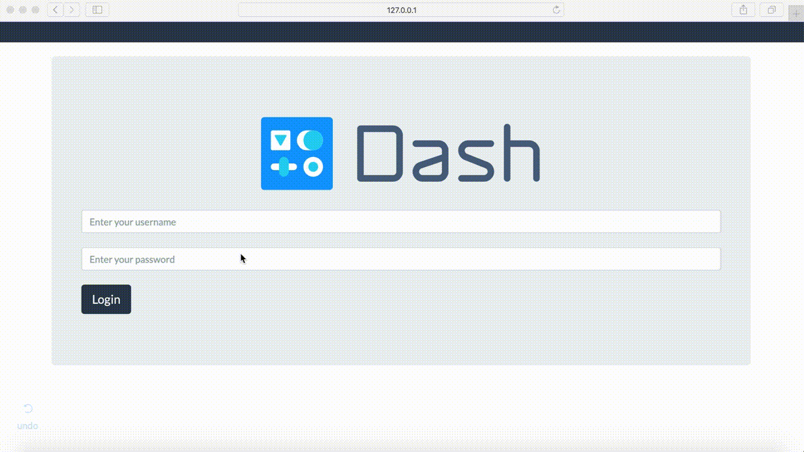

# Dash-User-Management

A template web app built in Plotly Dash for Python, which handles user creation, user authentication/login, user permissions (admin/non admin), and page navigation. This web app is a great starting point for developing a custom cloud based dashboard where the user base is relatively small e.g. accessible by team members or small organisations. 

Example of app in action with a demo layout on page 1:

The template uses Dash bootstrap components with the Flatly bootswatch theme - https://bootswatch.com/flatly/

The template has the following views:

1. `login.py` - User login page, displayed if a user tries to access any page and is not currently logged in
2. `page1.py` - Empty template page for your own Dash layout
3. `page2.py` - Another empty template page
4. `profile.py` - For users to update their own password
5. `user_admin.py` - A page for admin users only, with ability to create new users and view existing users
6. `404.py` - Simple 404 error message to catch requests for non-existent pages

# Database Setup

Default database setup is MySQL and the required table can be setup using the table_create_statement in `/db`.

The database username, password, and table name need be entered in `con` paramenter of `config.txt`.

Other databases can be used - refer to SQLAlchemy for required connection statement and update the `con` parameter of `config.txt`.

# Planned Improvements

1. Ability to delete / edit users from the Admin page
2. More validation on creating a new user from the Admin page (e.g. Username & Email should not already exist)

# Contributions

PRs accepted for suggested improvements!

